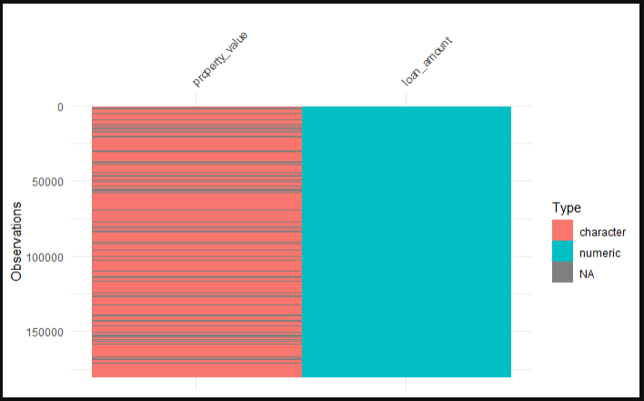

## Spotting and Handling NA Values

Missing values, represented as **`NA`** in R, are a common occurrence in datasets and can significantly impact the results of your data analysis. Therefore, identifying and understanding the extent of missing values is a crucial step in data exploration.

#### Understanding NA Values {.unlisted .unnumbered}

In R, **`NA`** (Not Available) is used to represent missing or undefined data. Missing values can arise due to various reasons such as data entry errors, data collection issues, or intentional omissions.

In the HMDA data that we have been working with, all of the reasons above apply. Sometimes financial institutions make errors when submitting the data, they are unable to collect the data for one reason or another, or certain data fields don't apply to certain loan applications.

#### Why Spotting NA Values is Important {.unlisted .unnumbered}

-   **Data Integrity:** Missing values can lead to incorrect conclusions if not handled properly.
-   **Analysis Readiness:** Many statistical and machine learning methods cannot handle missing values directly.
-   **Decision Making:** Identifying the pattern and extent of missing values can inform your strategy for handling them (e.g., imputation, removal).

### Common Ways to Spot NA Values

Identifying missing values is a critical part of data exploration. Here are some common ways to spot NA values using the **`hmda_data`** dataset that we loaded in.

#### Checking for Any NA Values {.unnumbered}

You can use the `anyNA()` function to check if there are any NA values in the entire dataset.

``` r
# Check if there are any NA values in the entire dataset
any_na <- anyNA(hmda_data)
print(any_na) # Returns TRUE if there are any NA values, otherwise FALSE
```

#### Counting NA Values Per Column {.unnumbered}

To understand which columns contain NA values and how many, you can use **`colSums(is.na())`**.

``` r
# Count the number of NA values in each column 
na_per_column <- colSums(is.na(hmda_data)) %>%
  as.data.frame()
```


In the script above, the following steps are performed:

**`is.na(hmda_data)`**: This function checks each element of the **`hmda_data`** dataset to see if it is an NA value. It returns a logical matrix of the same dimensions as **`hmda_data`**, where each element is **`TRUE`** if the corresponding element in **`hmda_data`** is NA, and **`FALSE`** otherwise.

**`colSums(is.na(hmda_data))`**: This function calculates the sum of **`TRUE`** values (which are treated as 1) for each column in the logical matrix. As a result, it provides a named vector where each name corresponds to a column in **`hmda_data`**, and each value represents the count of NA values in that column.

**`as.data.frame()`**: This function converts the named vector into a data frame. This step is useful for better readability and further manipulation of the results. The resulting data frame has two columns: one for the column names from the original dataset and one for the corresponding counts of NA values.

By running this script, you will obtain a data frame (**`na_per_column`**) that lists each column in **`hmda_data`** along with the number of NA values it contains. This information is crucial for understanding the extent of missing data in each column, which can guide your decisions on how to handle these missing values in subsequent analysis steps.

### Visualizing NA Values Using `visdat` Package

Visualizing missing values can provide a quick and intuitive understanding of the extent and distribution of NA values in your dataset. The **`visdat`** package in R offers a suite of tools for this purpose. In this section, we'll demonstrate how to visualize NA values using a subsample of the hmda_data dataset, focusing specifically on the "property_value" and "loan_amount" columns, we do this because the hmda_data is quite large and **`visdat`** can't handle large dataframes well.

#### Installing and Loading the `visdat` Package {.unnumbered}

First, ensure that the **`visdat`** package is installed and loaded. If you haven't installed it yet, you can do so with the following command:

``` r
install.packages("visdat")
```

#### Visualizing NA Values {.unnumbered}

To visualize the NA values in the **"property_value"** and **"loan_amount"** columns of the **hmda_data** dataset, you can use the **`vis_dat()`** function. Here's the script to create the visualization:

``` r
# Loading libraries
library(visdat)
library(dplyr)

# Visualizing NA values
vis_dat(hmda_data %>%
          select(loan_amount, property_value), warn_large_data = FALSE)
```



In this script:

-   **`hmda_data %>% select(loan_amount, property_value)`**: This line uses the `select()` function from the `dplyr` package to create a subsample of the `hmda_data` dataset, containing only the "loan_amount" and "property_value" columns.
-   **`vis_dat()`**: This function from the `visdat` package generates a visualization of the dataset, highlighting the NA values.
-   **`warn_large_data = FALSE`**: This argument suppresses warnings related to large datasets, which is useful when working with large data frames.

#### Understanding the Visualization {.unlisted .unnumbered}

The visualization generated by **`vis_dat()`** provides a color-coded barchart where each bar represents a value in the dataset. The colors indicate different data types or the presence of NA values:

-   **Gray cells**: Represent NA values.
-   **Other colors**: Represent different data types (e.g., numeric, character, etc.).

This visual representation makes it easy to spot patterns and concentrations of missing data. For example, you can quickly see if NA values are clustered in certain rows or columns, which might suggest specific reasons for the missing data.
