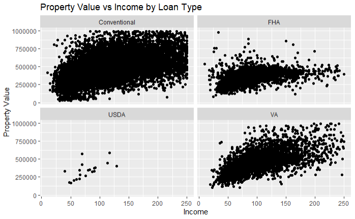
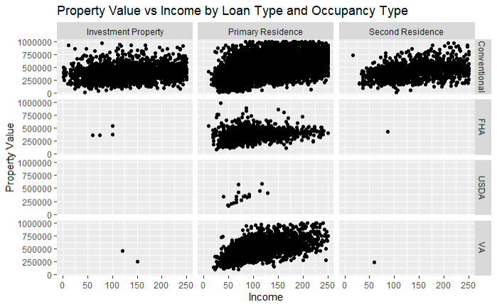
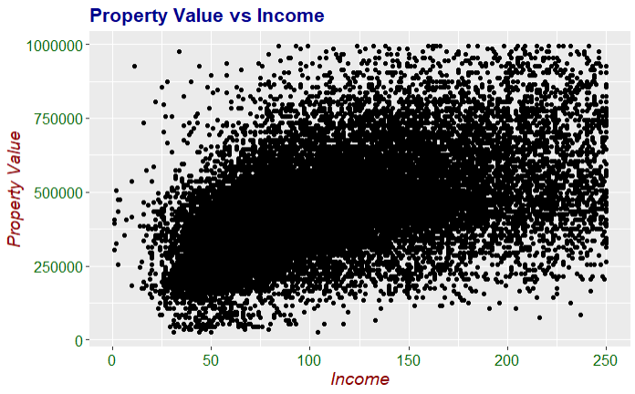
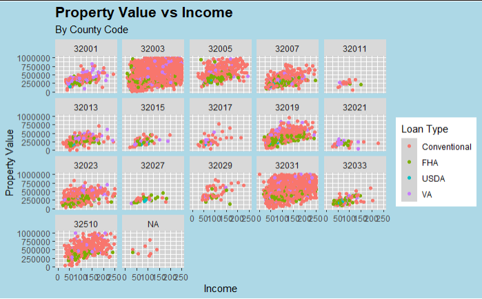
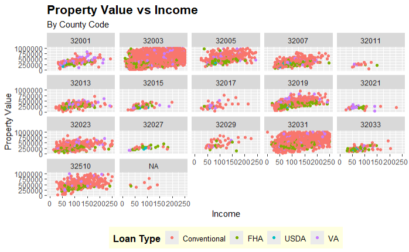
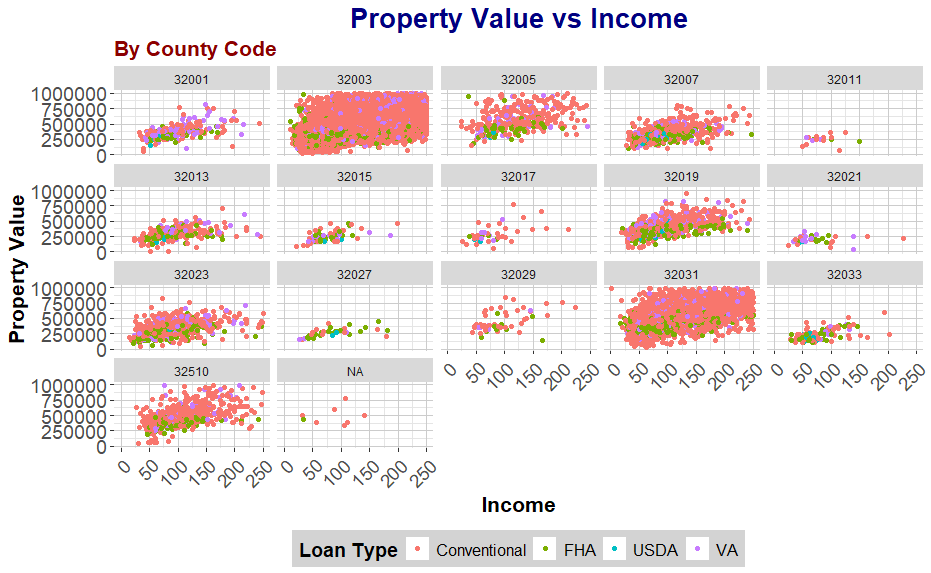

## Advanced ggplot2 Techniques

In this section, we will delve into more advanced features of ggplot2 that allow for creating complex and customized visualizations. This includes using facets, customizing themes, adding annotations, and creating multi-layered plots.

### Faceting

Faceting is a powerful technique to create multiple plots based on the values of one or more categorical variables. It allows you to compare different subsets of the data side by side.

#### Facet Wrap {.unnumbered}

The `facet_wrap()` function splits the data into multiple panels based on the values of a single categorical variable.

``` r
ggplot(data = filtered_hmda_data, aes(x = income, y = property_value)) +
  geom_point() +
  facet_wrap(~ loan_type) +
  labs(title = "Property Value vs Income by Loan Type",
       x = "Income",
       y = "Property Value")
```



In this example, `facet_wrap(~ loan_type)` creates separate panels for each loan type, allowing us to compare the relationship between income and property value across different loan types.

#### Facet Grid {.unnumbered}

The `facet_grid()` function allows for more complex faceting based on two variables, creating a matrix of panels.

I removed the filter the occupancy that limited occupancy to only primary residences. I also constructed a `case_when()` to label the occupancy type for each transaction

``` r
# Filter and prep HMDA data for plotting
filtered_hmda_data <- hmda_data%>%
  filter(
    # Filter for only originated transactions
    action_taken == 1,
    # Filter for only for home purchases
    loan_purpose == 1,
    # Filter for only primary homss
    # This has been commented out
    #occupancy_type == 1,
    # Filter for primary liens
    lien_status == 1,
    # Filter for single unit homes
    total_units == "1",
    # Filter propery value 
    !property_value %in% c("Exempt", NA),
    # Filter income for values below 250 but above 0
    income <=250 & income>0,
    # Filter for Clark County
    county_code == "32003"
    
  )%>%
  mutate(
    property_value = as.numeric(property_value),
    # Assigning labels for each loan_type
    loan_type = case_when(
      loan_type == 1 ~ "Conventional",
      loan_type == 2 ~ "FHA",
      loan_type == 3 ~ "VA",
      loan_type == 4 ~ "USDA"
    ),
    occupancy_type = case_when(
      occupancy_type == 1 ~ "Primary Residence",
      occupancy_type == 2 ~ "Second Residence",
      occupancy_type == 3 ~ "Investment Property"
    ))%>%
    # Only keep property values under $1 million
  filter(property_value<1000000)
```

Having prepped the data, we can now demonstrate the usage of `facet_grid()` .

``` r
ggplot(data = filtered_hmda_data, aes(x = income, y = property_value)) +
  geom_point() +
  facet_grid(loan_type ~ occupancy_type) +
  labs(title = "Property Value vs Income by Loan Type and Occupancy Type",
       x = "Income",
       y = "Property Value")
```



In this example, `facet_grid(loan_type ~ occupancy_type)` creates a grid of panels, with rows representing loan types and columns representing occupancy types.

### Customizing Themes

Customizing the appearance of plots is crucial for creating visually appealing and professional graphics. ggplot2 provides several built-in themes and allows for extensive customization.

#### Using Built-in Themes {.unnumbered}

ggplot2 includes several built-in themes that can be applied directly to your plots. Some common themes are `theme_minimal()`, `theme_classic()`, and `theme_dark()`.

##### Base Example {.unlisted .unnumbered}

``` r
ggplot(data = filtered_hmda_data, aes(x = income, y = property_value)) +
  geom_point() +
  labs(title = "Property Value vs Income",
       x = "Income",
       y = "Property Value")
```


##### Example with `theme_minimal()` {.unlisted .unnumbered} 

``` r
ggplot(data = filtered_hmda_data, aes(x = income, y = property_value)) +
  geom_point() +
  labs(title = "Property Value vs Income",
       x = "Income",
       y = "Property Value")+
  theme_minimal()
```


For a complete list of themes available from `ggplot2` see <https://ggplot2.tidyverse.org/reference/ggtheme.html>. Additional themes are also available from the `ggthemes` package. For more information on these see <https://yutannihilation.github.io/allYourFigureAreBelongToUs/ggthemes/>.

#### Customizing Themes in ggplot2 {.unnumbered}

Customizing themes in ggplot2 allows you to tailor the appearance of your plots to fit your specific needs, making them more informative and visually appealing. This can include adjusting the size, color, and font of text elements, modifying background and grid line properties, and much more. The `theme()` function is central to these customizations, providing a wide range of options to fine-tune each component of the plot.

For the purposes of this example, the filter on the `county_code` has been removed to demonstrate the customization capabilities more broadly.

``` r
filtered_hmda_data <- hmda_data %>%
  filter(
    action_taken == 1,
    loan_purpose == 1,
    occupancy_type == 1,
    lien_status == 1,
    total_units == "1",
    !property_value %in% c("Exempt", NA),
    income <= 250 & income > 0
  ) %>%
  mutate(
    property_value = as.numeric(property_value),
    loan_type = case_when(
      loan_type == 1 ~ "Conventional",
      loan_type == 2 ~ "FHA",
      loan_type == 3 ~ "VA",
      loan_type == 4 ~ "USDA"
    )
  ) %>%
  filter(property_value < 1000000)
```

#### Customizing Text Elements {.unnumbered}

The `theme()` function can be used to customize various text elements in your plot, such as titles, axis titles, and axis text. Each of these elements can be adjusted for size, font face, color, and alignment.

``` r
ggplot(data = filtered_hmda_data, aes(x = income, y = property_value, color = loan_type)) +
  geom_point() +
  labs(title = "Property Value vs Income",
       subtitle = "By County Code",
       x = "Income",
       y = "Property Value",
       color = "Loan Type") +
  theme(
    plot.title = element_text(size = 16, face = "bold", color = "darkblue"),
    plot.subtitle = element_text(size = 14, face = "italic", color = "darkred"),
    axis.title = element_text(size = 14, face = "italic", color = "darkred"),
    axis.text = element_text(size = 12, color = "darkgreen")
  ) +
  facet_wrap(~county_code)
```

In this example:

-   `plot.title = element_text(size = 16, face = "bold", color = "darkblue")` customizes the plot title to be bold, size 16, and dark blue.

-   `plot.subtitle = element_text(size = 14, face = "italic", color = "darkred")` customizes the plot subtitle to be italic, size 14, and dark red.

-   `axis.title = element_text(size = 14, face = "italic", color = "darkred")` customizes the axis titles to be italic, size 14, and dark red.

-   `axis.text = element_text(size = 12, color = "darkgreen")` customizes the axis text to be size 12 and dark green.

#### Customizing Background and Grid Lines {.unnumbered}

You can customize the background and grid lines to enhance the readability of your plots or to match a specific visual style.

``` r
ggplot(data = filtered_hmda_data, aes(x = income, y = property_value, color = loan_type)) +
  geom_point() +
  labs(title = "Property Value vs Income",
       subtitle = "By County Code",
       x = "Income",
       y = "Property Value",
       color = "Loan Type") +
  theme(
    panel.background = element_rect(fill = "lightgray"),
    panel.grid.major = element_line(color = "white", size = 0.5),
    panel.grid.minor = element_line(color = "white", size = 0.25),
    plot.background = element_rect(fill = "lightblue"),
    plot.title = element_text(size = 16, face = "bold")
  ) +
  facet_wrap(~county_code)
```



In this example:

-   `panel.background = element_rect(fill = "lightgray")` sets the panel background to light gray.

-   `panel.grid.major = element_line(color = "white", size = 0.5)` customizes the major grid lines to be white and size 0.5.

-   `panel.grid.minor = element_line(color = "white", size = 0.25)` customizes the minor grid lines to be white and size 0.25.

-   `plot.background = element_rect(fill = "lightblue")` sets the overall plot background to light blue.

#### Customizing Legend {.unnumbered}

The legend can also be customized to improve the clarity and appearance of your plots. You can adjust the legend position, title, text, and background.

``` r
ggplot(data = filtered_hmda_data, aes(x = income, y = property_value, color = loan_type)) +
  geom_point() +
  labs(title = "Property Value vs Income",
       subtitle = "By County Code",
       x = "Income",
       y = "Property Value",
       color = "Loan Type") +
  theme(
    legend.position = "bottom",
    legend.title = element_text(size = 12, face = "bold"),
    legend.text = element_text(size = 10),
    legend.background = element_rect(fill = "lightyellow"),
    plot.title = element_text(size = 16, face = "bold")
  ) +
  facet_wrap(~county_code)
```



In this example:

-   `legend.position = "bottom"` places the legend at the bottom of the plot.

-   `legend.title = element_text(size = 12, face = "bold")` customizes the legend title to be bold and size 12.

-   `legend.text = element_text(size = 10)` sets the legend text size to 10.

-   `legend.background = element_rect(fill = "lightyellow")` sets the legend background to light yellow.

#### Complete Theme Customization Example {.unnumbered}

Combining these customizations, you can create a fully customized theme for your plot.

``` r
ggplot(data = filtered_hmda_data, aes(x = income, y = property_value, color = loan_type)) +
  geom_point() +
  labs(title = "Property Value vs Income",
       subtitle = "By County Code",
       x = "Income",
       y = "Property Value",
       color = "Loan Type") +
  theme(
    plot.title = element_text(size = 20, face = "bold", color = "navy", hjust = 0.5),
    plot.subtitle = element_text(size = 16, face = "bold", color = "darkred"),
    axis.title = element_text(size = 16, face = "bold"),
    axis.text = element_text(size = 14),
    axis.text.x = element_text(angle = 45, hjust = 1),
    panel.background = element_rect(fill = "white"),
    panel.grid.major = element_line(color = "gray80", size = 0.5),
    panel.grid.minor = element_line(color = "gray90", size = 0.25),
    legend.position = "bottom",
    legend.title = element_text(size = 14, face = "bold"),
    legend.text = element_text(size = 12),
    legend.background = element_rect(fill = "lightgray")
  ) +
  facet_wrap(~county_code)
```



In this comprehensive example:

-   `plot.title = element_text(size = 20, face = "bold", color = "navy", hjust = 0.5)` centers the plot title and customizes its size, face, and color.

-   `plot.subtitle = element_text(size = 16, face = "bold", color = "darkred")` customizes the plot subtitle to be bold, size 16, and dark red.

-   `axis.text.x = element_text(angle = 45, hjust = 1)` rotates the x-axis text labels for better readability.

-   Other elements are customized as described in previous examples.

By utilizing the `theme()` function, you can create highly customized and polished visualizations tailored to your specific needs, making your data analysis and presentation more effective. This was meant to give you a rough idea of some of the customizations you can do with `ggplot2`, there are a myriad of other options available.
