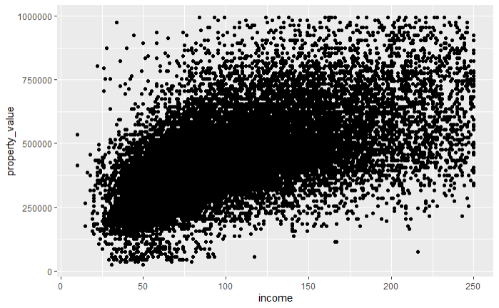
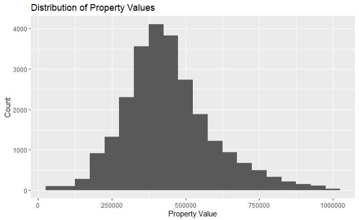
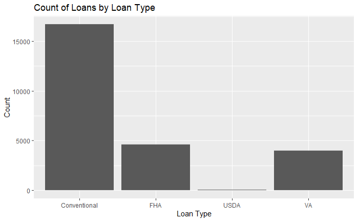
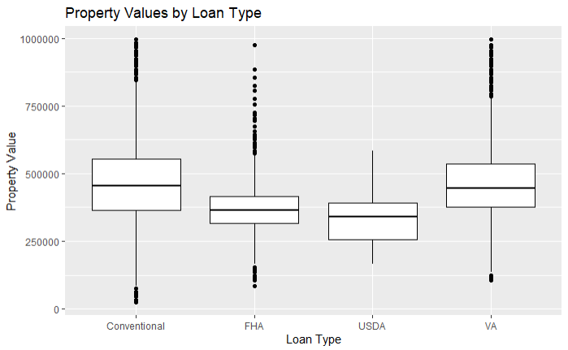
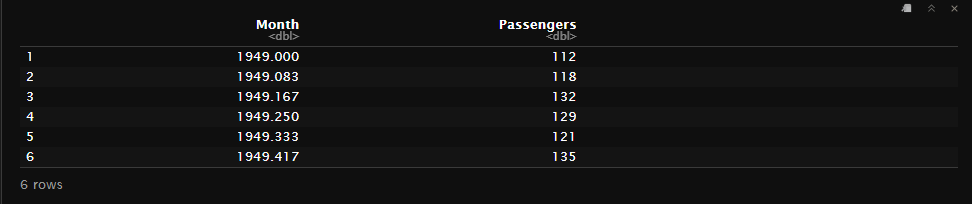
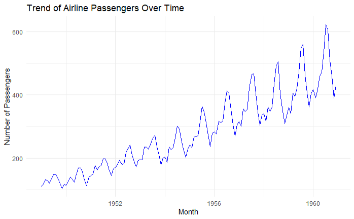

# Data Visualization

## Data Visualization Using `ggplot2`

### Introduction {.unlisted .unumbered}

Data visualization is a crucial step in data analysis as it helps in understanding the underlying patterns, trends, and relationships in the data. In this chapter, we will explore how to create various types of visualizations using the ggplot2 package in R, focusing on HMDA (Home Mortgage Disclosure Act) data.

### Getting Started with ggplot2

First, ensure you have ggplot2 installed. If not, you can install it using:

``` r
install.packages("ggplot2")
```

This will download the latest version of `ggplot2` from the CRAN repository.

Load the package along with with the HMDA data:

``` r
library(ggplot2)
library(dplyr)  # For data manipulation
options(scipen = 999) # To prevent R from printing in scientific notation

# Load HMDA data
hmda_data <- read_csv("downloads/state_NV.csv", guess_max = Inf)
```

Once we have the data loaded, we proceed to do some preliminary prep and cleanup. The schema for the different data fields avaialable can be found at: <https://ffiec.cfpb.gov/documentation/publications/modified-lar/modified-lar-schema>

``` r
# Filter and prep HMDA data for plotting
filtered_hmda_data <- hmda_data%>%
  filter(
    # Filter for only originated transactions
    action_taken == 1,
    # Filter for only for home purchases
    loan_purpose == 1,
    # Filter for only primary homss
    occupancy_type == 1,
    # Filter for primary liens
    lien_status == 1,
    # Filter for single unit homes
    total_units == "1",
    # Filter propery value 
    !property_value %in% c("Exempt", NA),
    # Filter income for values below 250 but above 0
    income <=250 & income>0,
    # Filter for Clark County
    county_code == "32003"
    
  )%>%
  mutate(
    property_value = as.numeric(property_value),
    # Assigning labels for each loan_type
    loan_type = case_when(
      loan_type == 1 ~ "Conventional",
      loan_type == 2 ~ "FHA",
      loan_type == 3 ~ "VA",
      loan_type == 4 ~ "USDA"
    ))%>%
    # Only keep property values under $1 million
  filter(property_value<1000000)
```

### Basic Plot Structure {.unlisted .unnumbered}

The structure of a ggplot2 plot is built around the `ggplot()`\*\* function and the `+` operator to add layers. Here's a simple example of a scatter pplot:

``` r
ggplot(data = filtered_hmda_data, aes(x = income, y = property_value))+
  geom_point()
```



In this example, `ggplot()` is the initial function call to create a new plot. The function takes the following primary arguments:

-   `data`: This argument specifies the dataset to be used in the plot. In this case, `filtered_hmda_data` is the dataset containing the HMDA data.
-   `aes()`: Short for aesthetics, this function defines the mapping of variables in your data to visual properties (aesthetics) such as x and y axes, colors, shapes, and sizes of points or lines. In the example, `x = income` maps the `income` variable to the x-axis, and `y = property_value` maps the `property_value` variable to the y-axis.

After the initial `ggplot()` function, we add layers to the plot using the **`+`** operator. Each layer represents a specific component of the plot, such as points, lines, bars, etc.

-   `geom_point()`: This is a geometric object (geom) layer that adds a scatter plot layer to the plot. Each point represents an observation in the dataset.

### Creating Basic Plot Types with ggplot2

In this section, we will explore how to create various types of basic plots using ggplot2. We will start with histograms, bar plots, box plots, and line plots, each serving different purposes in data visualization.

#### Histogram {.unnumbered}

Histograms are useful for visualizing the distribution of a single continuous variable. For example, let's create a histogram to visualize the distribution of property values in our filtered HMDA data.

``` r
ggplot(data = filtered_hmda_data, aes(x = property_value)) +
  geom_histogram(binwidth = 50000) +
  labs(title = "Distribution of Property Values",
       x = "Property Value",
       y = "Count")
```



-   `geom_histogram(binwidth = 50000, fill = "blue", color = "black")` adds a histogram layer with specified bin width, fill color, and border color.
-   `labs()` is used to add titles and labels to the plot.

#### Bar Plot {.unnumbered}

Bar plots are useful for visualizing categorical data. Let's create a bar plot to visualize the count of loans by loan type.

``` r
ggplot(data = filtered_hmda_data, aes(x = loan_type)) +
  geom_bar() +
  labs(title = "Count of Loans by Loan Type",
       x = "Loan Type",
       y = "Count")
```

-   `ggplot(data = filtered_hmda_data, aes(x = loan_type))`: This line initializes the ggplot object with the specified dataset (`filtered_hmda_data`) and maps the loan_type column to the x-axis.
-   `geom_bar()`: This adds a bar plot layer to the ggplot object. By default, geom_bar() counts the number of occurrences of each loan_type.
-   `labs(title = "Count of Loans by Loan Type", x = "Loan Type", y = "Count")`: This function is used to add titles and labels to the plot. It specifies the plot title and labels for the x and y axes..



#### Box Plot {.unnumbered}

Box plots are useful for visualizing the distribution of a continuous variable across different categories. Let's create a box plot to visualize property values by loan type.

``` r
ggplot(data = filtered_hmda_data, aes(x = loan_type, y = property_value)) +
  geom_boxplot() +
  labs(title = "Property Values by Loan Type",
       x = "Loan Type",
       y = "Property Value")
```



In this example:

-   `geom_boxplot()` adds a box plot layer.

-   `labs()` is used to add titles and labels to the plot.

#### Line Plot {.unnumbered}

Line plots are useful for visualizing trends over time or ordered categories. Since the HMDA data we have been working with is not historical, we will use one of R's built-in datasets, AirPassengers, to demonstrate creating a line plot. The `AirPassengers` dataset contains monthly totals of international airline passengers from 1949 to 1960.

First, let's load the dataset and take a look at its structure:

``` r
# Load the AirPassengers dataset
data("AirPassengers")
airpassengers_data <- data.frame(
  Month = time(AirPassengers),
  Passengers = as.numeric(AirPassengers)
)
```



The `airpassengers_data` dataframe has two columns: `Month` and `Passengers`.

#### Creating a Line Plot {.unnumbered .unlisted}

Now, let's create a line plot to visualize the trend of airline passengers over time.

``` r
ggplot(data = airpassengers_data, aes(x = Month, y = Passengers)) +
  geom_line(color = "blue") +
  labs(title = "Trend of Airline Passengers Over Time",
       x = "Month",
       y = "Number of Passengers") +
  theme_minimal()
```



In this example:

-   `ggplot(data = airpassengers_data, aes(x = Month, y = Passengers))`: Initializes the ggplot object with the `airpassengers_data` dataset and maps the `Month` column to the x-axis and the `Passengers` column to the y-axis.

-   `geom_line(color = "blue")`: Adds a line plot layer with the line color set to blue.

-   `labs(title = "Trend of Airline Passengers Over Time", x = "Month", y = "Number of Passengers")`: Adds a title and labels to the plot.

-   `theme_minimal()`: Applies a minimalistic theme to the plot.
