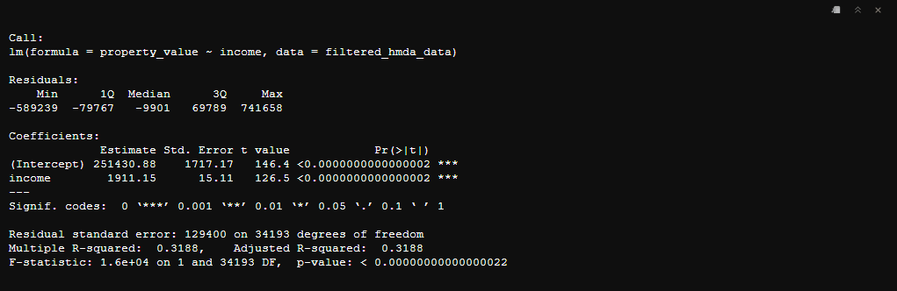
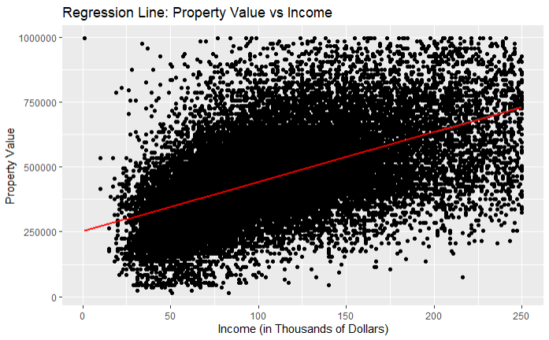
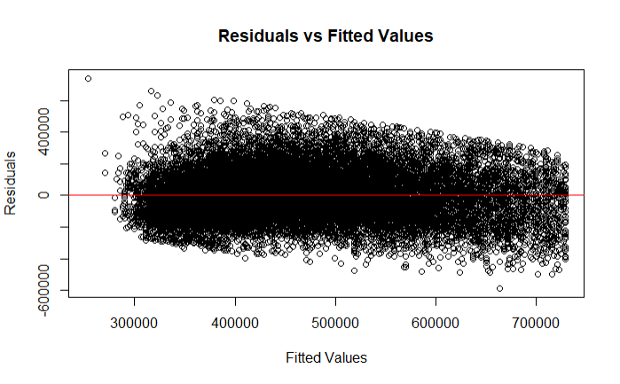
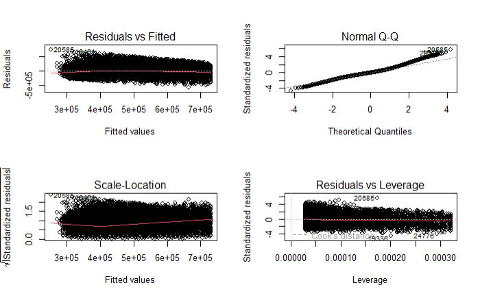

# Basic Regression Analysis in R

## Introduction {.unlisted .unumbered}

Regression analysis is a powerful statistical method used to examine the relationship between a dependent variable and one or more independent variables. In this chapter, we will explore how to perform basic regression analysis in R using the HMDA (Home Mortgage Disclosure Act) dataset. Specifically, we will use the `income` variable to predict `property_value`.

### Preparing the Data {.unlisted .unumbered}

Before performing regression analysis, it's crucial to ensure that the data is clean and properly formatted. We'll start by loading the necessary packages and preparing the HMDA data.

``` r
library(ggplot2)
library(dplyr)
library(readr)

# Load HMDA data
hmda_data <- read_csv("downloads/state_NV.csv", guess_max = Inf)

# Filter and prep HMDA data for regression analysis
filtered_hmda_data <- hmda_data %>%
  filter(
    action_taken == 1,
    loan_purpose == 1,
    occupancy_type == 1,
    lien_status == 1,
    total_units == "1",
    !property_value %in% c("Exempt", NA),
    income <= 250 & income > 0
  ) %>%
  mutate(
    property_value = as.numeric(property_value),
    loan_type = case_when(
      loan_type == 1 ~ "Conventional",
      loan_type == 2 ~ "FHA",
      loan_type == 3 ~ "VA",
      loan_type == 4 ~ "USDA"
    )
  ) %>%
  filter(property_value < 1000000)
```

## Simple Linear Regression

Simple linear regression is used to model the relationship between two continuous variables. In this case, we will model the relationship between `income` (independent variable) and `property_value` (dependent variable).

### Fitting the Model 

We use the `lm()` function to fit a linear model.

``` r
# Fit the linear regression model
lm_model <- lm(property_value ~ income, data = filtered_hmda_data)

# Display the summary of the model
summary(lm_model)
```



### Interpreting the Results

Let's interpret the results of the simple linear regression model using the provided output.

#### Coefficients {.unnumbered}

The `Coefficients` section provides the estimated values of the intercept and slope in the regression equation:

-   **Intercept**: 251,430.88

    -   This represents the estimated property value when `income` is zero.

-   **Income**: 1,911.15

    -   This represents the estimated change in property value for each unit increase in `income`.

#### Statistical Significance {.unnumbered}

The `Pr(>|t|)` column provides the p-values for the coefficients:

-   **Intercept**: The p-value is less than 0.0000000000000002, indicating that the intercept is statistically significant.

-   **Income**: The p-value is also less than 0.0000000000000002, indicating that `income` is a statistically significant predictor of `property_value`.

#### Model Fit {.unnumbered}

-   **Residual standard error**: 129,400 on 34,193 degrees of freedom

    -   This represents the average distance that the observed values fall from the regression line.

-   **Multiple R-squared**: 0.3188

    -   This indicates that approximately 31.88% of the variance in `property_value` can be explained by `income`.

-   **Adjusted R-squared**: 0.3187

    -   This is similar to the R-squared value but adjusted for the number of predictors in the model.

-   **F-statistic**: 1.6e+04 on 1 and 34,193 DF, p-value: \< 0.00000000000000022

    -   This indicates that the model is statistically significant overall.

The results suggest that there is a statistically significant positive relationship between `income` and `property_value`. For every unit increase in `income`, the `property_value` is expected to increase by approximately 1,911.15 units, holding other factors constant. The R-squared value indicates that `income` explains about 31.88% of the variability in `property_value`, which suggests that other factors not included in the model may also play a significant role in determining property values.

#### Visualizing the Regression Line {.unnumbered}

We can visualize the regression line using ggplot2.

``` r
ggplot(data = filtered_hmda_data, aes(x = income, y = property_value)) +
  geom_point() +
  geom_smooth(method = "lm", col = "red") +
  labs(title = "Regression Line: Property Value vs Income",
       x = "Income (in Thousands of Dollars)",
       y = "Property Value")
```



In this plot:

-   `geom_point()` adds the data points.

-   `geom_smooth(method = "lm", col = "red")` adds the regression line with the color red.

#### Plotting Residuals Using `lm()` {.unnumbered}

You can plot residuals of a linear model fitted with `lm()` using several methods in R. One common way is to use base R plotting functions to create diagnostic plots. Here is how you can plot the residuals:

1.  **Basic Residual Plot**: Plotting residuals versus fitted values.

``` r
# Fit the linear regression model
lm_model <- lm(property_value ~ income, data = filtered_hmda_data)

# Plot residuals vs. fitted values
plot(lm_model$fitted.values, lm_model$residuals,
     xlab = "Fitted Values",
     ylab = "Residuals",
     main = "Residuals vs Fitted Values")
abline(h = 0, col = "red")
```



2.  **Diagnostic Plots** Plotting multiple diagnostic plots at once.

``` r
# Fit the linear regression model
lm_model <- lm(property_value ~ income, data = filtered_hmda_data)

# Produce diagnostic plots
par(mfrow = c(2, 2)) # just lets R know we want the plots to be in 2x2 structure
plot(lm_model)
```



The `plot(lm_model)` function produces four diagnostic plots:

-   Residuals vs Fitted

-   Normal Q-Q

-   Scale-Location (Spread-Location)

-   Residuals vs Leverage

These plots help to assess the fit of the model and to identify any potential issues such as non-linearity, heteroscedasticity, and influential observations.
